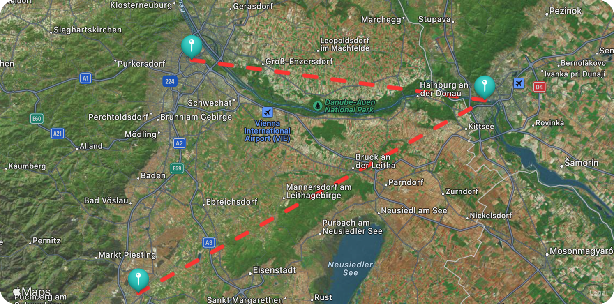

# LPMapView

> ℹ️ See the full documentation [here](https://lukepistrol.github.io/LPMapView/documentation/lpmapview).

A **SwiftUI** wrapper for `MKMapView`.

## Overview

This offers a couple more features compared to `SwiftUI.Map`.

## Usage

```swift
@State private var coordinateRegion: MKCoordinateRegion = ...
@State private var items: [MapViewAnnotation] = ...

MapView(
  region: $coordinateRegion, 
  showsUserLocation: false,
  userTrackingMode: .none,
  annotations: items
)
.mapDisplayRoute() // connect annotations with lines
.mapAnnotations(.hidden) // hide annotation markers
.mapConfiguration(.hybrid) // use the hybrid map style
```

The above example usage would deliver a map view similar to this one:



## Modifiers

There are a couple of modifiers available for configuring additional
options for the map view.

### mapDisplayRoute

#### Declaration

```swift
func mapDisplayRoute(
  _ visibility: MapViewVisibility = .visible, 
  tint: Color = .blue, 
  width: Double = 5
) -> some View
```

#### Parameters

- `visibility`: Whether or not the route will be visible.
- `tint`: The tint color of the route track.
- `width`: The line width of the route track.

### mapAnnotations

#### Declaration

```swift
func mapAnnotations(
  _ visibility: MapViewVisibility = .visible, 
  tint: Color = .red, 
  calloutEnabled: Bool = false, 
  fitInVisibleRect: Bool = false
) -> some View
```

#### Parameters

- `visibility`: Whether or not annotations will be visible.
- `tint`: The default tint color of the annotation. This can
be overridden by setting ``MapViewAnnotation/tint`` on
``MapViewAnnotation``.
- `calloutEnabled`: Whether or not to show a detail callout
when an annotation is selected. Note that this will only
work if the annotation has a title.
- `fitInVisibleRect`: Whether or not to automatically adjust
map zoom to fit all annotations.

### mapConfiguration

#### Declaration

```swift
func mapConfiguration(
  _ configuration: MapViewConfiguration, 
  elevationStyle: MKMapConfiguration.ElevationStyle = .flat
) -> some View
```

#### Parameters

- `configuration`: A configuration option defining the map
style.
- `elevationStyle`: Defines how elevation data is handled
when rendering the map view.

---

<a href="https://www.buymeacoffee.com/lukeeep" target="_blank"></a>
